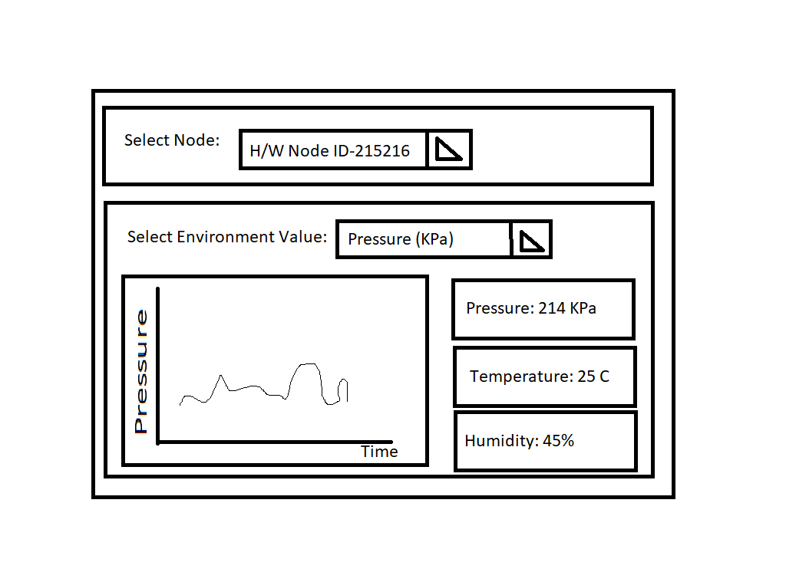

<!-- Main Header -->

# _EnvDash_ - Dashboard for _EnvVision_ Environment Monitoring System

<!-- Badges & Shields -->

<!-- Elevator Pitch -->

## 1. Elevator Pitch

[&nbsp;<a href="#heading">Back to Top</a> &nbsp;•&nbsp; <a href="#table-of-contents">Table of Contents</a>&nbsp;]

<!-- Visual Preview / Gallery (Screenshots/GIFs placeholder) -->

## 2. Gallery

<!-- Dashboard Rough Sketch -->
<figure>
    
    <figcaption>Dashboard Rough Sketch</figcaption>
</figure>

[&nbsp;<a href="#heading">Back to Top</a> &nbsp;•&nbsp; <a href="#table-of-contents">Table of Contents</a>&nbsp;]

<!-- Table of Contents -->

## Table of Contents
| # | Section |
|---|---|
| **1.** | [Elevator Pitch](#elevator-pitch) |
| **2.** | [Gallery](#gallery) |
| **3.** | [Key Technical Features](#key-technical-features) |
| **4.** | [System Architecture & Design Patterns](#system-architecture-and-design-patterns) |
|  | 4.1 &emsp;[Sub-Section 1](#) |
|  | 4.2 &emsp;[Sub-Section 2](#) |
|  | 4.3 &emsp;[Sub-Section 3](#) |
| **5.** | [Tech Stack & Module Matrix](#tech-stack-and-module-matrix) |
| **6.** | [Build & Development Setup](#build-and-development-setup) |
| **7.** | [Project Scope & Roadmap](#project-scope-and-roadmap) |
|  | 7.1 &emsp;[Project Scope](#project-scope) |
|  | 7.2 &emsp;[Project Roadmap](#project-roadmap) |
| **8.** | [Testing & Static Analysis](#testing-and-static-analysis) |

[&nbsp;<a href="#heading">Back to Top</a> &nbsp;•&nbsp; <a href="#table-of-contents">Table of Contents</a>&nbsp;]

<!-- Key Technical Features (What makes this hard/interesting?) -->

## 3. Key Technical Features

[&nbsp;<a href="#heading">Back to Top</a> &nbsp;•&nbsp; <a href="#table-of-contents">Table of Contents</a>&nbsp;]

<!-- System Architecture & Design Patterns (The technical proof) -->

## 4. System Architecture & Design Patterns

[&nbsp;<a href="#heading">Back to Top</a> &nbsp;•&nbsp; <a href="#table-of-contents">Table of Contents</a>&nbsp;]

<!-- Tech Stack & Module Matrix -->

## 5. Tech Stack & Module Matrix

[&nbsp;<a href="#heading">Back to Top</a> &nbsp;•&nbsp; <a href="#table-of-contents">Table of Contents</a>&nbsp;]

<!-- Build & Development Setup (Windows MSVC/MinGW & Linux setup) -->

## 6. Build & Development Setup

[&nbsp;<a href="#heading">Back to Top</a> &nbsp;•&nbsp; <a href="#table-of-contents">Table of Contents</a>&nbsp;]

<!-- V1.0.0 Scope, Roadmap & Progress (Checklist showing project management skill) -->

## 7. Project Scope & Roadmap

### 7.1 Project Scope (Component: Dashboard - _EnvDash_)

The primary objective of **_EnvDash_** is to provide a real-time desktop interface for visualizing environmental sensor telemetry originating from hardware nodes (Pico 2 firmware) or simulated environments/mock hardware (Python).

#### In-Scope (v1.0 Deliverables)
* **Real-Time Telemetry Visualization:** Live rendering of temperature, humidity, and atmospheric metrics using Qt Quick / QML widgets and dynamic charts.
* **Multi-Transport Support:** Data ingestion over Serial (UART/USB) for physical hardware connections and IPC/Local Sockets for communication with the Python mock hardware simulator.
* **Hardware Status Monitoring:** UI indicators for connection state, packet loss, transmission frequency, and system threshold alerts.
* **Configurable Dashboard Settings:** Controls enabling users to adjust sample rates, threshold triggers, and chart timeframes dynamically.
* **Cross-Platform Target:** Build targets verified on both Windows (MSVC/MinGW) and Linux (GCC) environments.

 

#### Out-of-Scope (v1.0 Non-Goals)
* **Cloud Storage & Remote Sync:** No direct backend cloud integration (AWS/Azure) or remote database persistence for v1.0; logging is handled locally.
* **Mobile / Web Platforms:** Exclusive focus on desktop environments (no iOS, Android, or WebAssembly targets).
* **User Authentication:** Single-user local desktop application without user login or permission roles.
* **Direct Firmware Flashing:** The application consumes telemetry streams only and does not perform OTA or direct firmware flashing to the microcontroller.

[&nbsp;<a href="#heading">Back to Top</a> &nbsp;•&nbsp; <a href="#table-of-contents">Table of Contents</a>&nbsp;]

### 7.2 Project Roadmap (Component: Dashboard _EnvDash_)
- [ ] **Feature:** Setup Project Skeleton. Define project scope, features & tasks
    - [x] ✔️ **Task:** Setup minimal CI/CD script with test job &emsp;<small>[&nbsp; **Completed:** 31.07.2026 &nbsp;|&nbsp; **Author:** [@riciadavinci](https://github.com/riciadavinci) &nbsp;]</small>
    - [x] ✔️ **Task:** Define project scope &emsp;<small>[&nbsp; **Completed:** 01.08.2026 &nbsp;|&nbsp; **Author:** [@riciadavinci](https://github.com/riciadavinci) &nbsp;]</small>
    - [x] ✔️ **Task:** Define project features and tasks loosely &emsp;<small>[&nbsp; **Completed:** 01.08.2026 &nbsp;|&nbsp; **Author:** [@riciadavinci](https://github.com/riciadavinci) &nbsp;]</small>
    - [ ] **Task:** Create main.qml and use it with main.cpp
    - [ ] **Task:** Setup CMakeLists.txt to compile for main.cpp
    - [ ] **Task:** Create simple GUI App that builds successfully
- [ ] **Feature:** Setup Full CI/CD Pipeline
    - [ ] **Task:** Setup working CMake Build Task
    - [ ] **Task:** Setup working Clang-Tidy Analysis
    - [ ] **Task:** Setup Google Test
    - [ ] **Task:** Setup Unit-Tests execution
    - [ ] **Task:** Setup GCov/LCov Coverage Report Generation
- [ ] **Feature:**
    - [ ] **Task:** 

<!-- - [ ] **Feature:** Setup Full CI/CD Pipeline &emsp;[&nbsp; **Completed:** 11.06.2026 &nbsp;|&nbsp; **Merge/PR:** [a3f1f66](https://github.com/riciadavinci/EnvVisionEnvironmentMonitoringSystem/commit/a3f1f66b9da4bb4b6993f7b7090cecea019e56a8) &nbsp;]
    - [x] **Task:** Setup minimal skeleton with Sample Job &emsp;[&nbsp; **Completed:** 01.08.2026 &nbsp;|&nbsp; **Author:** [@riciadavinci](https://github.com/riciadavinci) &nbsp;]
	- [ ] **Task:** Setup Clang-Tidy Static Analysis Job
- [ ] **Feature:** Setup CMakeLists.txt and Source Files Skeleton -->

[&nbsp;<a href="#heading">Back to Top</a> &nbsp;•&nbsp; <a href="#table-of-contents">Table of Contents</a>&nbsp;]

<!-- Testing & Static Analysis -->

## 8. Testing & Static Analysis

[&nbsp;<a href="#heading">Back to Top</a> &nbsp;•&nbsp; <a href="#table-of-contents">Table of Contents</a>&nbsp;]

